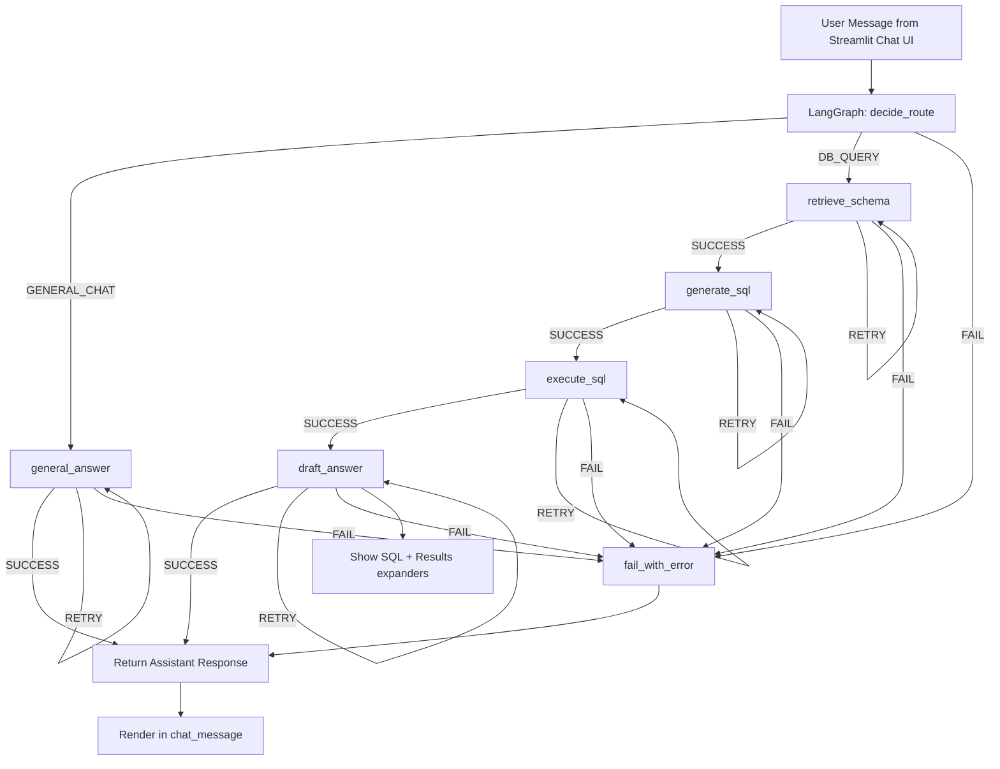

# Agentic SQL RAG Assistant (LangGraph + Streamlit)

This project builds an agentic SQL assistant for SQL Server:

- Schema-aware RAG over DB metadata (`INFORMATION_SCHEMA` + extended properties)
- Direct open-source embeddings via `SentenceTransformer`
- Direct FAISS vector index (`faiss`) with local persistence
- Hybrid retrieval: FAISS dense + BM25 lexical + RRF fusion
- Bi-encoder reranking before passing context to SQL generation
- LangGraph pipeline with routing, retries, and failure fallback
- Retrieval evaluation: Precision@K, Recall@K, MRR

## Architecture Graph



### DB Query Pipeline

```mermaid
flowchart LR
    Q[User Query] --> R[Hybrid Retrieval from Schema Index]
    R -->|FAISS + BM25 + RRF + Reranker| S[Schema Context]
    S --> T[LLM SQL Generation (schema-aware rules)]
    T --> U[SQL Server Execution]
    U --> V[LLM Answer Synthesis]
    V --> W[Assistant Output]
```

## SQL generation behavior

- Router first classifies user request into `DB_QUERY` or `GENERAL_CHAT`.
- SQL is generated from the retrieved schema context and user question only.
- STDBCOD domain rules currently applied in prompt:
  - COD order issue tracking source table is `edm_cod_jsm_dly` (`issue_type` driven).
  - For creation logic in `edm_cod_jsm_dly`, priority is `dice_ins_dt`, then `dice_ins_crt_dt` if `dice_ins_dt` is unavailable.
  - For creation logic in other tables, priority is `dice_ins_crt_dt`, then `dice_ins_dt`.
  - For updation logic, use `dice_ins_upd_st`.
  - These `dice_` audit columns are preferred over other timestamp/date fields when present.

## Retry and failure behavior

- Each graph step is wrapped in retry-aware execution.
- On step failure, the same step is retried using conditional edges.
- Default retry limit is `max_retries = 2` (tracked in agent state).
- If retries are exhausted, the flow goes to `fail_with_error` and returns a clear failure message including failed step and error text.

## 1) Setup

```bash
python -m venv .venv
.venv\Scripts\activate
pip install -r requirements.txt
```

## 2) Configure environment

Create `.env` (or copy from `.env.example`) and set values read by `os.getenv` in `src/config.py`.

Key variables:

- `DB_TYPE`, `DB_HOST`, `DB_PORT`, `DB_USERNAME`, `DB_PASSWORD`, `DB_DATABASE`
- `DB_DRIVER`, `DB_JDBC_URL`, `DB_JDBC_DRIVER`
- `HF_MODEL_ID`, `HUGGINGFACEHUB_API_TOKEN`
- `EMBEDDING_MODEL`, `RERANKER_MODEL`
- `HYBRID_CANDIDATE_MULTIPLIER`, `RRF_K`, `RERANKER_CANDIDATE_MULTIPLIER`
- `VECTOR_DB_DIR`, `MAX_SQL_ROWS`
- Optional tracing: `LANGSMITH_TRACING`, `LANGSMITH_ENDPOINT`, `LANGSMITH_API_KEY`, `LANGSMITH_PROJECT`

## 3) Build schema index

```bash
python build_schema_index.py
```

## 4) Run retrieval evaluation

```bash
python -m eval.evaluate_retrieval
```

## 5) Run Streamlit app

```bash
streamlit run app.py
```

The app allows you to refresh schema index, ask DB questions, review generated SQL, and inspect results.

## Run notes

- Prefer module-style runs from repo root when possible.
- If DB connectivity fails, verify network/VPN access and SQL Server ODBC driver installation.
